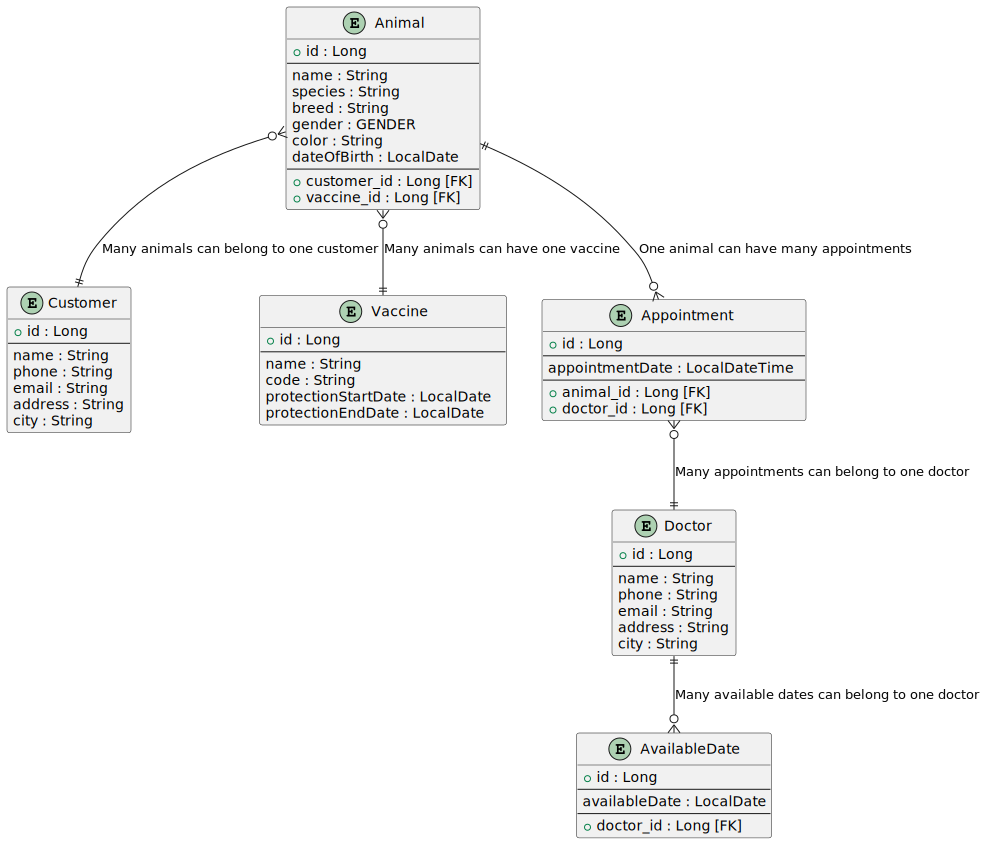
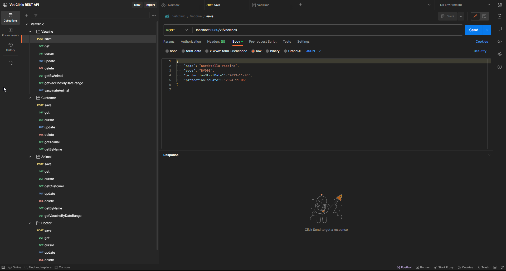
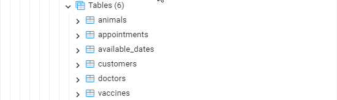
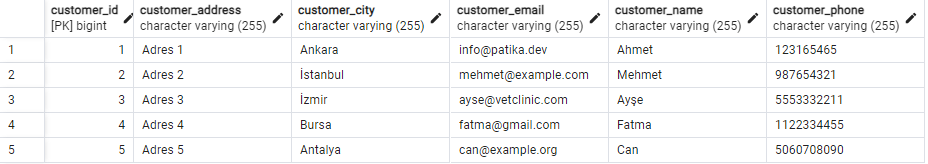
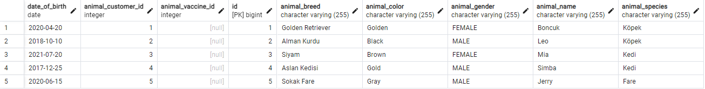
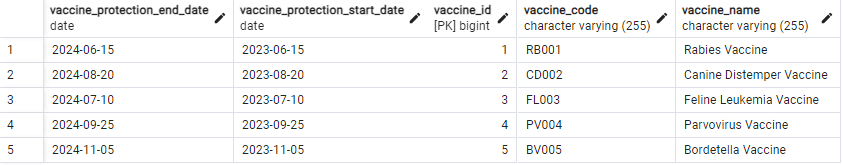
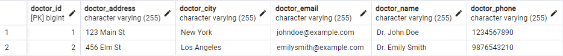
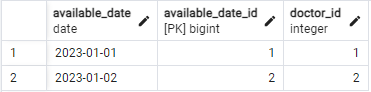
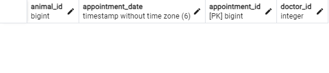

# Veteriner Yönetim Sistemi

## Başka Dillerde Oku :books:

- :tr: [Türkçe](README.md)
- :uk: [English](README_EN.md)

Veteriner Yönetim Sistemi, bir veteriner kliniğinin işlerini yönetmesine yardımcı olan bir RESTful API'dir. Bu API, veteriner doktorları, müşteriler, hayvanlar, aşılar ve randevular dahil olmak üzere çeşitli kaynakları yönetmek için endpoint'ler sağlar.

### Teknolojiler

    

### Başlıca Özellikler

- Veteriner doktorları kaydetme, güncelleme, görüntüleme ve silme
- Doktorların müsait günlerini kaydetme, güncelleme, görüntüleme ve silme
- Müşterileri kaydetme, güncelleme, görüntüleme ve silme
- Müşterilere ait hayvanları kaydetme, güncelleme, görüntüleme ve silme
- Hayvanlara uygulanan aşıları kaydetme, güncelleme, görüntüleme ve silme
- Hayvanlar için veteriner hekimlere randevu oluşturma, güncelleme, görüntüleme ve silme

### Proje Ekran Görüntüleri

*Entity Relationship Diagram*

*Postman Koleksiyonu https://www.postman.com/bpolatt/workspace/vet-clinic-rest-api/overview*

*Database Yapısı ve İçindeki Örnek Veriler*

### API Endpoint'leri

### Veteriner Doktorları Yönetme

- `POST /v1/doctors`: Yeni bir doktor oluşturur.
- `GET /v1/doctors/{id}`: Belirli bir ID'ye sahip doktoru alır.
- `PUT /v1/doctors`: Bir doktoru günceller.
- `DELETE /v1/doctors/{id}`: Belirli bir ID'ye sahip doktoru siler.

### Doktorların Müsait Günlerini Yönetme

- `POST /v1/available-dates`: Yeni bir müsait tarih oluşturur.
- `GET /v1/available-dates/{id}`: Belirli bir ID'ye sahip müsait tarihi alır.
- `PUT /v1/available-dates`: Bir müsait tarihi günceller.
- `DELETE /v1/available-dates/{id}`: Belirli bir ID'ye sahip müsait tarihi siler.

### Müşterileri Yönetme

- `POST /v1/customers`: Yeni bir müşteri oluşturur.
- `GET /v1/customers/{id}`: Belirli bir ID'ye sahip müşteriyi alır.
- `PUT /v1/customers`: Bir müşteriyi günceller.
- `DELETE /v1/customers/{id}`: Belirli bir ID'ye sahip müşteriyi siler.
- `GET /v1/customers/{id}/animals`: Belirli bir ID'ye sahip müşterinin hayvanlarını alır.
- `GET /v1/customers/filterByName`: Müşterileri isimlerine göre filtreler.

### Müşterilere Ait Hayvanları Yönetme

- `POST /v1/animals`: Yeni bir hayvan oluşturur.
- `GET /v1/animals/{id}`: Belirli bir ID'ye sahip hayvanı alır.
- `PUT /v1/animals`: Bir hayvanı günceller.
- `DELETE /v1/animals/{id}`: Belirli bir ID'ye sahip hayvanı siler.
- `GET /v1/animals/{id}/customer`: Belirli bir ID'ye sahip hayvanın sahibini alır.
- `GET /v1/animals/filter`: Hayvanları isimlerine göre filtreler.
-  `GET /v1/animals/vaccines`: Tarih aralığına göre hayvanlara uygulanan aşıları alır.

### Hayvanlara Uygulanan Aşıları Yönetme

- `POST /v1/vaccines`: Yeni bir aşı oluşturur.
- `GET /v1/vaccines/{id}`: Belirli bir ID'ye sahip aşıyı alır.
- `PUT /v1/vaccines`: Bir aşıyı günceller.
- `DELETE /v1/vaccines/{id}`: Belirli bir ID'ye sahip aşıyı siler.
- `GET /v1/vaccines/animal/{animalId}`: Belirli bir ID'ye sahip hayvana uygulanan aşıları alır.
- `GET /v1/vaccines/protection-dates`: Girilen tarih aralığına göre aşı koruma tarihlerini alır.
- `PUT /v1/vaccines/vaccinate`: Bir hayvana aşı uygular.

### Hayvanlar İçin Veteriner Hekimlere Randevu Oluşturma

- `POST /v1/appointments/create`: Yeni bir randevu oluşturur.
- `GET /v1/appointments/{id}`: Belirli bir ID'ye sahip randevuyu alır.
- `PUT /v1/appointments`: Bir randevuyu günceller.
- `DELETE /v1/appointments/{id}`: Belirli bir ID'ye sahip randevuyu siler.
- `GET /v1/appointments/doctor/{doctorId}`: Retrieves appointments for a specific doctor within a specific date range.
- `GET /v1/appointments/animal/{animalId}`: Retrieves appointments for a specific animal within a specific date range.

### Veritabanı Yapısı

Veritabanı altı ana varlık içerir: `Doktor`, `UygunTarih`, `Müşteri`, `Hayvan`, `Aşı`, ve `Randevu`.

- `Doktor`: Klinikteki veterinerleri temsil eder. Her doktorun bir `UygunTarih` ve `Randevu` listesi bulunur.
- `UygunTarih`: Bir doktorun uygun tarihlerini temsil eder. Her uygun tarih bir `Doktor` ile ilişkilidir.
- `Müşteri`: Kliniğin müşterilerini temsil eder. Her müşterinin bir `Hayvan` listesi bulunur.
- `Hayvan`: Müşterilere ait hayvanları temsil eder. Her hayvan bir `Müşteri` ile ilişkilidir ve bir `Aşı` ve `Randevu` listesine sahiptir.
- `Aşı`: Hayvanlara uygulanan aşıları temsil eder. Her aşı bir `Hayvan` ile ilişkilidir.
- `Randevu`: Hayvanların bir doktora görünmesi için yapılan randevuları temsil eder. Her randevu bir `Doktor` ve bir `Hayvan` ile ilişkilidir.

### Kurulum
1. Bu projeyi klonlayın.
2. Proje içindeki `vetclinic.sql` dosyasını kullanarak postgresql veritabanını oluşturun.
3. `src/main/resources/application.properties` dosyasını açın ve veritabanı bağlantı bilgilerini güncelleyin.
4. https://www.postman.com/bpolatt/workspace/vet-clinic-rest-api/overview adresinden Postman koleksiyonunu indirin.
5. Postman koleksiyonunu Postman'e import edin.
6. Postman koleksiyonundaki istekleri kullanarak API'yi test edin.

### Katkıda Bulunma

Bu proje açık kaynaklıdır ve katkılarınıza açıktır. Katkıda bulunmak için lütfen aşağıdaki adımları izleyin:

1. Projeyi Forklayın
2. Kendi Fork'unuzda bir Feature Branch oluşturun (`git checkout -b feature/AmazingFeature`)
3. Değişikliklerinizi Commit edin (`git commit -m 'Add some AmazingFeature'`)
4. Branch'ı Push edin (`git push origin feature/AmazingFeature`)
5. Pull Request oluşturun

### License

Bu proje MIT lisansı ile lisanslanmıştır. Daha fazla bilgi için [LICENSE](LICENSE) dosyasına bakın.

### İletişim

  <a href="https://github.com/Bpolat0">
    

  <a href="https://discord.com/users/m.batuhanpolat">
    

  
  <a href="https://app.patika.dev/bpolat">
    

