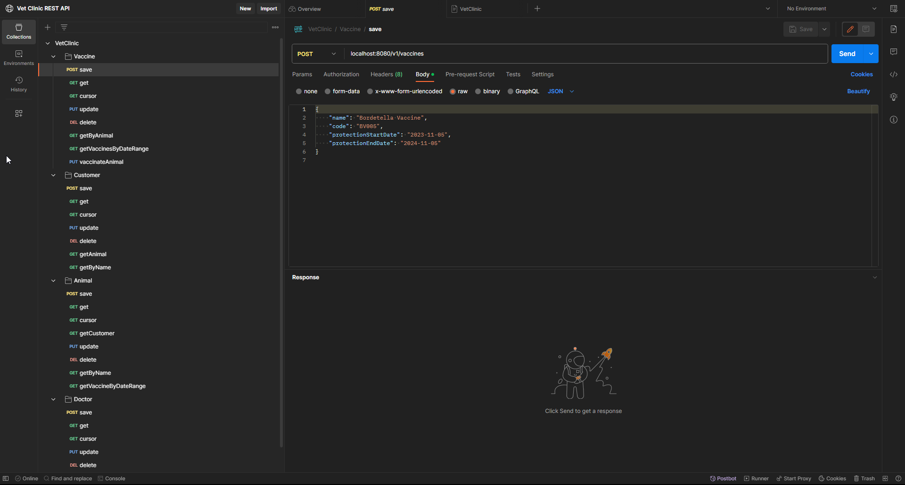
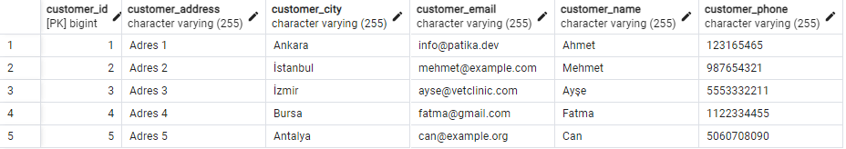
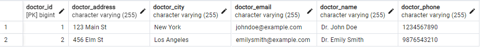
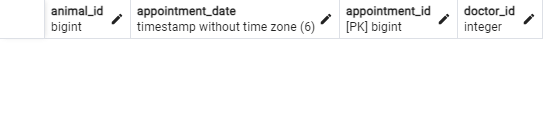

# Veterinary Management System

## Readme in Other Languages :books:

- :tr: [Türkçe](README.md)
- :uk: [English](README_EN.md)

Veterinary Management System is a RESTful API that helps manage the operations of a veterinary clinic. This API provides endpoints to manage various resources, including veterinary doctors, customers, animals, vaccines, and appointments.

### Tech Stack

    

### Main Features

- Managing veterinarians: saving, updating, viewing, and deleting
- Managing the available days of doctors: saving, updating, viewing, and deleting
- Managing customers: saving, updating, viewing, and deleting
- Managing animals belonging to customers: saving, updating, viewing, and deleting
- Managing vaccines applied to animals: saving, updating, viewing, and deleting
- Creating appointments for animals to veterinarians: saving, updating, viewing, and deleting

### Project Screenshots

*Entity Relationship Diagram*

*Postman Collection https://www.postman.com/bpolatt/workspace/vet-clinic-rest-api/overview*

*Database Structure and Sample Data*

### API Endpoints

### Managing Veterinary Doctors

- `POST /v1/doctors`: Creates a new doctor.
- `GET /v1/doctors/{id}`: Retrieves a doctor with a specific ID.
- `PUT /v1/doctors`: Updates a doctor.
- `DELETE /v1/doctors/{id}`: Deletes a doctor with a specific ID.

### Managing Doctors' Available Dates

- `POST /v1/available-dates`: Creates a new available date.
- `GET /v1/available-dates/{id}`: Retrieves an available date with a specific ID.
- `PUT /v1/available-dates`: Updates an available date.
- `DELETE /v1/available-dates/{id}`: Deletes an available date with a specific ID.

### Managing Customers

- `POST /v1/customers`: Creates a new customer.
- `GET /v1/customers/{id}`: Retrieves a customer with a specific ID.
- `PUT /v1/customers`: Updates a customer.
- `DELETE /v1/customers/{id}`: Deletes a customer with a specific ID.
- `GET /v1/customers/{id}/animals`: Retrieves animals owned by a customer with a specific ID.
- `GET /v1/customers/filterByName`: Filters customers by their names.

### Managing Animals Belonging to Customers

- `POST /v1/animals`: Creates a new animal.
- `GET /v1/animals/{id}`: Retrieves an animal with a specific ID.
- `PUT /v1/animals`: Updates an animal.
- `DELETE /v1/animals/{id}`: Deletes an animal with a specific ID.
- `GET /v1/animals/{id}/customer`: Retrieves the owner of an animal with a specific ID.
- `GET /v1/animals/filter`: Filters animals by their names.
- `GET /v1/animals/vaccines`: Retrieves vaccines administered to animals within a date range.

### Managing Vaccines Administered to Animals

- `POST /v1/vaccines`: Creates a new vaccine.
- `GET /v1/vaccines/{id}`: Retrieves a vaccine with a specific ID.
- `PUT /v1/vaccines`: Updates a vaccine.
- `DELETE /v1/vaccines/{id}`: Deletes a vaccine with a specific ID.
- `GET /v1/vaccines/animal/{animalId}`: Retrieves vaccines administered to an animal with a specific ID.
- `GET /v1/vaccines/protection-dates`: Retrieves vaccine protection dates within a given date range.
- `PUT /v1/vaccines/vaccinate`: Administers a vaccine to an animal.

### Creating Appointments for Animals with Veterinary Doctors

- `POST /v1/appointments/create`: Creates a new appointment.
- `GET /v1/appointments/{id}`: Retrieves an appointment with a specific ID.
- `PUT /v1/appointments`: Updates an appointment.
- `DELETE /v1/appointments/{id}`: Deletes an appointment with a specific ID.
- `GET /v1/appointments/doctor/{doctorId}`: Retrieves appointments for a specific doctor within a specific date range.
- `GET /v1/appointments/animal/{animalId}`: Retrieves appointments for a specific animal within a specific date range.

### Database Structure

The database consists of six main entities: `Doctor`, `AvailableDate`, `Customer`, `Animal`, `Vaccine`, and `Appointment`.

- `Doctor`: Represents the veterinarians in the clinic. Each doctor has a list of `AvailableDate` and `Appointment`.
- `AvailableDate`: Represents the available dates of a doctor. Each available date is associated with a `Doctor`.
- `Customer`: Represents the customers of the clinic. Each customer has a list of `Animal`.
- `Animal`: Represents the animals owned by customers. Each animal is associated with a `Customer` and has a list of `Vaccine` and `Appointment`.
- `Vaccine`: Represents the vaccines applied to animals. Each vaccine is associated with an `Animal`.
- `Appointment`: Represents the appointments for animals to see a doctor. Each appointment is associated with a `Doctor` and an `Animal`.

### Installation
1. Clone the repository.
2. Inside the project, create the postgre database for using the `vetclinic.sql` file.
3. Open the `src/main/resources/application.properties` file and update the database connection information.
4. Download the Postman collection from https://www.postman.com/bpolatt/workspace/vet-clinic-rest-api/overview.
5. Import the Postman collection into Postman.
6. Use the requests in the Postman collection to test the API.

### Contributing

This project is open source and contributions are welcome. To contribute, please follow the steps below:

1. Fork the project
2. Create a Feature Branch in your own Fork (`git checkout -b feature/AmazingFeature`)
3. Commit your changes (`git commit -m 'Add some AmazingFeature'`)
4. Push the Branch (`git push origin feature/AmazingFeature`)
5. Create a Pull Request

### License

Distributed under the MIT License. See [LICENSE](LICENSE) for more information.

### İletişim

  <a href="https://github.com/Bpolat0">
    

  <a href="https://discord.com/users/m.batuhanpolat">
    

  
  <a href="https://app.patika.dev/bpolat">
    

