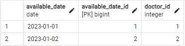

# Veterinary Management System

## Readme in Other Languages :books:

- :tr: [Türkçe](README.md)
- :uk: [English](README_EN.md)

Veterinary Management System is a RESTful API that helps manage the operations of a veterinary clinic. This API provides endpoints to manage various resources, including veterinary doctors, customers, animals, vaccines, and appointments.

### Tech Stack

    

### Main Features

- Managing veterinarians: saving, updating, viewing, and deleting
- Managing the available days of doctors: saving, updating, viewing, and deleting
- Managing customers: saving, updating, viewing, and deleting
- Managing animals belonging to customers: saving, updating, viewing, and deleting
- Managing vaccines applied to animals: saving, updating, viewing, and deleting
- Creating appointments for animals to veterinarians: saving, updating, viewing, and deleting

### Project Screenshots

*Entity Relationship Diagram*

*Postman Collection https://www.postman.com/bpolatt/workspace/vet-clinic-rest-api/overview*

*Database Structure and Sample Data*

### API Endpoints

### Managing Veterinary Doctors

- `POST http://localhost:8080/v1/doctors`: Creates a new doctor.
- `GET http://localhost:8080/v1/doctors/1`: Retrieves a doctor with a specific ID.
- `GET http://localhost:8080/v1/doctors?page=0&size=3`: Retrieves doctors with pagination and sorting.
- `PUT http://localhost:8080/v1/doctors`: Updates a doctor.
- `DELETE http://localhost:8080/v1/doctors/1`: Deletes a doctor with a specific ID.

### Managing Available Dates for Doctors

- `POST http://localhost:8080/v1/available-dates`: Creates a new available date.
- `GET http://localhost:8080/v1/available-dates/1`: Retrieves an available date with a specific ID.
- `GET http://localhost:8080/v1/available-dates?page=0&size=3`: Retrieves available dates with pagination and sorting.
- `PUT http://localhost:8080/v1/available-dates`: Updates an available date.
- `DELETE http://localhost:8080/v1/available-dates/1`: Deletes an available date with a specific ID.

### Managing Customers

- `POST http://localhost:8080/v1/customers`: Creates a new customer.
- `GET http://localhost:8080/v1/customers/1`: Retrieves a customer with a specific ID.
- `GET http://localhost:8080/v1/customers?page=0&size=3`: Retrieves customers with pagination and sorting.
- `GET http://localhost:8080/v1/customers/1/animals`: Retrieves animals of a customer with a specific ID.
- `GET http://localhost:8080/v1/customers/filterByName?name=ahmet`: Filters customers by their names.
- `PUT http://localhost:8080/v1/customers`: Updates a customer.
- `DELETE http://localhost:8080/v1/customers/1`: Deletes a customer with a specific ID.

### Managing Animals Belonging to Customers

- `POST http://localhost:8080/v1/animals`: Creates a new animal.
- `GET http://localhost:8080/v1/animals/1`: Retrieves an animal with a specific ID.
- `GET http://localhost:8080/v1/animals?page=0&size=3`: Retrieves animals with pagination and sorting.
- `GET http://localhost:8080/v1/animals/1/customer`: Retrieves the owner of an animal with a specific ID.
- `GET http://localhost:8080/v1/animals/filter?name=Peluş`: Filters animals by their names.
- `GET http://localhost:8080/v1/animals/vaccines?startDate=2022-01-01&endDate=2024-12-31`: Retrieves vaccines applied to animals within a date range.
- `PUT http://localhost:8080/v1/animals/1`: Updates an animal with a specific ID.
- `DELETE http://localhost:8080/v1/animals/1`: Deletes an animal with a specific ID.

### Managing Vaccines Applied to Animals

- `POST http://localhost:8080/v1/vaccines`: Creates a new vaccine.
- `GET http://localhost:8080/v1/vaccines/1`: Retrieves a vaccine with a specific ID.
- `GET http://localhost:8080/v1/vaccines?page=0&size=3`: Retrieves vaccines with pagination and sorting.
- `GET http://localhost:8080/v1/vaccines/animal/1`: Retrieves vaccines applied to an animal with a specific ID.
- `GET http://localhost:8080/v1/vaccines/protection-dates?start_date=2023-12-31&end_date=2024-12-31`: Retrieves vaccine protection dates within a specified date range.
- `PUT http://localhost:8080/v1/vaccines`: Updates a vaccine.
- `DELETE http://localhost:8080/v1/vaccines/1`: Deletes a vaccine with a specific ID.
- `PUT http://localhost:8080/v1/vaccines/vaccinate`: Applies a vaccine to an animal.

### Creating Appointments for Animals with Veterinary Doctors

- `POST http://localhost:8080/v1/appointments/create`: Creates an appointment for an animal.
- `GET http://localhost:8080/v1/appointments/1`: Retrieves an appointment with a specific ID.
- `GET http://localhost:8080/v1/appointments?page=0&size=3`: Retrieves appointments with pagination and sorting.
- `GET http://localhost:8080/v1/appointments/doctor/1?start_date_time=2023-01-01T10:00:00&end_date_time=2023-05-01T11:00:00`: Retrieves appointments for a specific doctor within a specified date range.
- `GET http://localhost:8080/v1/appointments/animal/2?start_date_time=2023-01-01T10:00:00&end_date_time=2023-02-01T11:00:00`: Retrieves appointments for a specific animal within a specified date range.
- `PUT http://localhost:8080/v1/appointments`: Updates an appointment.
- `DELETE http://localhost:8080/v1/appointments/1`: Deletes an appointment with a specific ID.

### Installation
1. Clone the repository.
2. Inside the project, create the postgre database for using the `vetclinic.sql` file.
3. Open the `src/main/resources/application.properties` file and update the database connection information.
4. Download the Postman collection from https://www.postman.com/bpolatt/workspace/vet-clinic-rest-api/overview.
5. Import the Postman collection into Postman.
6. Use the requests in the Postman collection to test the API.

### Contributing

This project is open source and contributions are welcome. To contribute, please follow the steps below:

1. Fork the project
2. Create a Feature Branch in your own Fork (`git checkout -b feature/AmazingFeature`)
3. Commit your changes (`git commit -m 'Add some AmazingFeature'`)
4. Push the Branch (`git push origin feature/AmazingFeature`)
5. Create a Pull Request

### License

Distributed under the MIT License. See [LICENSE](LICENSE) for more information.

### İletişim

  <a href="https://github.com/Bpolat0">
    

  <a href="https://discord.com/users/m.batuhanpolat">
    

  
  <a href="https://app.patika.dev/bpolat">
    

